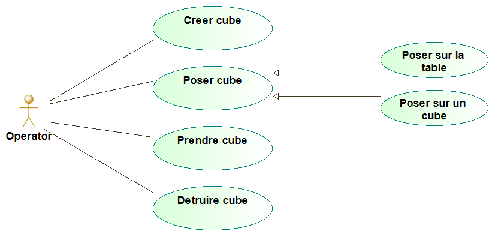

# Monde_des_blocs

Nous travaillerons sur la modélisation d'un système communément appelé "monde des
blocs". Dans ce monde, l'utilisateur peut piloter un bras articulé (un robot) capable de
manipuler des cubes (les blocs) de taille et de couleur variables et de les empiler pour
construire des piles de cubes disposées sur une table. Le robot répond aux ordres de celui
qui le pilote, ordres exprimés par le biais de phrases courtes qu'il est capable de
comprendre, du genre "prends le grand cube bleu".

##Description du diagramme des use-cases

Dans notre diagramme de use case notre operateur peut créer un cube, poser un cube, prendre un cube et
détruire un cube.
Créer cube : Pour créer un cube, il suffit d’avoir le robot de vide.
Poser cube : Poser un cube donne 2 possibilités,
-Poser sur la table :
Pour poser un cube sur la table, il faut vérifier que notre robot tient un cube et que la table ai
assez de place pour déposer un cube par-dessus.
-Poser sur un cube :
Pour poser un cube sur la table, il faut vérifier que notre robot tient un cube et que le cube
sur lequel on pose notre cube existe.
Prendre cube :
Pour prendre un cube de la table, il faut vérifier que notre robot est vide et que le cube qu’on
recherche est présent sur la table.
Détruire cube : Pour détruire un cube faut vérifier que notre robot tient un cube.
